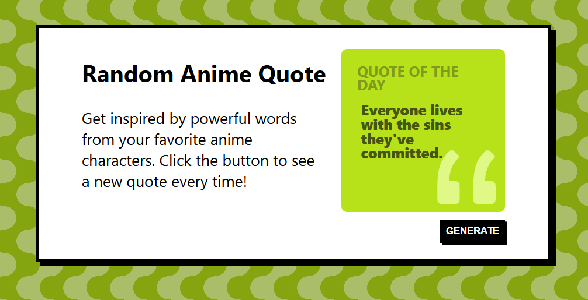

# Random Quote Generator :speech_balloon:
Small project i made while learning fetching from external APIs and react folder structure.

## Deployment
Frontend deployed at Vercel => ([Vercel Deployment](https://randomquote.stepanblaha.com/)) 
Backend running on Render => ([Render](https://dashboard.render.com/))

## Usage 
Click the generate button and the app will generate random anime quote each time. 
 

## Built with
* 
* 
* 
